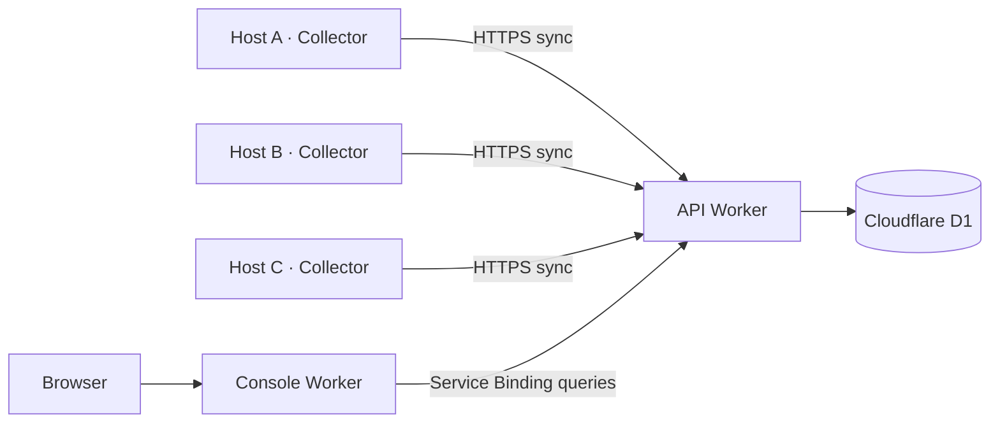

# Tokscale Serverless

English | [简体中文](README_CN.md)

Usage tracking and synchronization for AI coding tools across multiple hosts, built on [Tokscale](https://github.com/junhoyeo/tokscale).

This project uses Tokscale's `tokscale-core` to parse local session records and measure token usage, adding **synchronization across hosts, aggregated cloud storage, and a unified web dashboard**. The backend runs on Cloudflare Workers and D1, while the collector runs on your own Linux, macOS, or Windows machines.

## Features

- **Usage across hosts**: View usage from multiple computers and development servers in one place, with breakdowns by device, client, model, and date.
- **Daily usage card**: See today's token total and hourly curves grouped by device, tool, or model. The heatmap and chart share the same selection; click a square to inspect another day. A header control switches all token values between compact and full numbers. Built with React and Recharts, with matching light and dark themes.
- **Install from the console**: Choose your OS and download the latest published release, or copy an installation command that saves the connection automatically.
- **Automatic collection and synchronization**: Enter the Worker URL and token once. The collector verifies and saves the connection, then uses it on subsequent launches. By default, it scans and synchronizes every 60 seconds.
- **Self-hosted deployment**: Run the API, database, and console in your own Cloudflare account, with a shared token authenticating device uploads.
- **Cross-platform collector**: Build targets are available for Linux x86_64, Windows x86_64, macOS Intel, and Apple Silicon.
- **Local queries and exports**: An HTTP API provides local usage queries, aggregated data exports, and manual refreshes.
- **Qoder support**: An additional Qoder data source extends upstream parsing support. Credits are tracked separately from costs in USD.

Supported data sources depend on the pinned version of `tokscale-core`. Some clients require you to generate local caches or exports using the upstream instructions before the collector can read them.

## Architecture



| Component | Directory | Responsibilities |
| --- | --- | --- |
| Collector | [`client/`](client/) | Rust + Axum; parses local data, serves a local API, and uploads on a schedule |
| Cloud API | [`worker/api/`](worker/api/) | Authenticates requests, receives uploads, reads and writes D1, and queries aggregated usage |
| Web console | [`worker/console/`](worker/console/) | Static dashboard, API queries, and Access-authenticated installation commands through a Service Binding |
| Database migrations | [`worker/api/migrations/`](worker/api/migrations/) | Schemas for devices, daily/hourly usage, credits, and the deployed API address |

The console uses **Workers Static Assets**. It and the API are separate Workers; no separate Cloudflare Pages project is required.

### Data and synchronization

The collector scans once at startup, then rescans at the configured interval and uploads aggregated results to `/api/ingest`. The backend updates rows by device, date, client, and model, so repeated uploads from the same device do not double-count usage. Synchronization failures are logged; local queries remain available, and synchronization is retried after the next scan.

Hourly totals add an hour (0–23) to those dimensions and include all five token categories. Dates and hours follow each collector's local timezone, matching the heatmap; hosts in different timezones are not converted to one common timezone. Older collectors remain compatible but provide only daily totals. Upgrade and resync to backfill hourly data from retained local records; records without usable timestamps remain daily-only.

Uploads contain summary metrics such as token usage, costs, message counts, and Qoder credits, along with the device ID, name, hostname, operating system, and architecture. Raw conversation text is not uploaded. The shared token is sent in an authentication header, not in the statistics payload.

Complete the initial connection separately on each host so that each retains its own generated device ID. Do not copy an entire `device.json` from one host to another, as both hosts would be treated as the same device. Synchronization currently does not delete historical cloud rows that are absent from a later scan, nor does it deduplicate copies of the same session across different hosts.

## Quick start: connect a collector

Deploy the backend as described below and have your **API Worker URL** and `INGEST_TOKEN` ready. If you already have a deployment, start here.

### Download the collector

Click the **download icon beside the theme toggle** to open the installation dialog. Choose your OS/architecture, then download the latest published GitHub Release or copy the installation command: Bash on Linux/macOS, PowerShell on Windows. The command includes the API URL and `INGEST_TOKEN` directly and can be reused.

The installer verifies `SHA256SUMS`, uses `connect` to save the connection, and installs under `~/.local/bin` (Linux/macOS) or `%LOCALAPPDATA%\Programs\tokscale` (Windows). Existing device identity is preserved. Follow the printed `run` command to start collection, or use `~/.local/bin/tokscale-client service install` on Linux/macOS for [background operation](#run-in-the-background).

You can also download directly from [GitHub Releases](https://github.com/HSwift/tokscale-serverless/releases/latest) and connect manually below. If no release is available yet, download an artifact from a successful GitHub Actions build.

| Platform | Archive |
| --- | --- |
| Linux x86_64 | `tokscale-client-x86_64-unknown-linux-musl.tar.gz` |
| Windows x86_64 | `tokscale-client-x86_64-pc-windows-msvc.zip` |
| macOS Apple Silicon | `tokscale-client-aarch64-apple-darwin.tar.gz` |
| macOS Intel | `tokscale-client-x86_64-apple-darwin.tar.gz` |

Linux builds link statically against musl, and Windows builds use the static MSVC CRT. The minimum macOS deployment target is 11.0. Prebuilt collectors require neither Rust nor Node.js to run.

### Initial connection

Linux / macOS:

```bash
./tokscale-client connect https://your-api.example.com
./tokscale-client run
```

Windows PowerShell:

```powershell
.\tokscale-client.exe connect https://your-api.example.com
.\tokscale-client.exe run
```

Replace the example URL with your API Worker URL and enter the `INGEST_TOKEN` configured during deployment. You can use either the Worker root URL or the full `/api/ingest` URL. After successful verification, `connect` saves the configuration and exits. Run `run` to start collecting. Token input is hidden.

You can also launch the collector in a terminal without arguments. If no connection is configured, it prompts for the URL and token, then starts collecting immediately after verification. Subsequent launches use the saved configuration without prompting again.

| Command | Behavior |
| --- | --- |
| `connect [WORKER_URL]` | Verifies and saves a connection; also updates the URL or token. Existing configuration is preserved if verification fails |
| `run` | Continuously collects and synchronizes using the saved connection; exits without prompting if configuration is missing |
| `local` | Collects data and serves the local API only, ignoring the cloud connection |
| `service <COMMAND>` | Installs and manages a Linux systemd user service or macOS LaunchAgent |
| `--help` | Shows command help and the current configuration file path |

Repeat these steps on other hosts using the same API URL and token to view them together in the console.

## Deploy to Cloudflare

Deploy two Workers and one D1 database in your own Cloudflare account. **Cloudflare Workers Builds deploys the cloud services; GitHub Actions only builds the collector.** Cloudflare credentials stay in Cloudflare.

### 1. Prepare the repository and database

Fork this repository. In Cloudflare, create a D1 database named `tokscale-serverless`, or reuse an existing database with that name. The included Wrangler configuration declares the `DB` binding and resolves the database by name; no `D1_DATABASE_ID` variable or personal database ID in Git is needed.

### 2. Connect both Workers to GitHub

In **Workers & Pages**, import your fork to create the **API Worker first**, then the Console Worker after the API has deployed. For existing Workers, use **Settings → Builds → Connect**. Both connect to the same repository and `main` branch.

| Setting | API Worker | Console Worker |
| --- | --- | --- |
| Worker name | `tokscale-serverless-api` | `tokscale-serverless-console` |
| Root directory | `/worker/api/` | `/worker/console/` |
| Build command | `npm --prefix .. ci && npm --prefix .. run check && npm --prefix .. run build:api` | `npm --prefix .. ci && npm --prefix .. run check && npm --prefix .. run build:console` |
| Deploy command | `npm --prefix .. run deploy:api` | `npm --prefix .. run deploy:console` |
| Build variables | `NODE_VERSION=24`, `SKIP_DEPENDENCY_INSTALL=1` | Same |

Disable builds for non-production branches unless you configure separate preview resources. Keep the Worker names above, or update the corresponding Wrangler `name` fields and the console's `API` Service Binding together.

Select a Cloudflare-managed build token or an appropriate existing token. The API token needs **D1 → Edit** in addition to Worker deployment permissions: `deploy:api` applies database migrations automatically. See [Workers Builds configuration](https://developers.cloudflare.com/workers/ci-cd/builds/configuration/#api-token).

Once connected, pushes to `main` trigger checks, builds, and deployment for both Workers.

### 3. Set the token and domains

In **each Worker → Settings → Variables and Secrets**, add the same **Secret** named `INGEST_TOKEN`. Save this token for your collectors. This is a runtime secret, not a Build variable or a Cloudflare deployment token.

In **Settings → Domains & Routes → Add → Custom Domain**, bind a domain to the console and optionally another to the API. The console requires a custom domain; its `workers.dev` and version URLs are disabled by default. The API can use its `workers.dev` URL. Domains are managed in Cloudflare; no `CUSTOM_DOMAIN` variable or domain in Git is needed.

`deploy:api` automatically records the API's `workers.dev` address from Wrangler's deployment output. Installation works immediately after deployment, including for the first collector; no additional URL variable or prior upload is needed.

### 4. Protect the console with Access

Without Access, the console allows public read access to statistics. Before connecting devices:

1. In **Zero Trust → Access controls → Applications**, create a [self-hosted application](https://developers.cloudflare.com/cloudflare-one/access-controls/applications/http-apps/self-hosted-public-app/) for the **console domain**, with the path left empty. Add an **Allow** policy for your email and select a login method, such as [One-time PIN](https://developers.cloudflare.com/cloudflare-one/integrations/identity-providers/one-time-pin/).
2. In **API Worker → Settings → Variables and Secrets**, add these runtime **text variables**:

   | Variable | Value |
   | --- | --- |
   | `ACCESS_TEAM_DOMAIN` | `https://YOUR_TEAM.cloudflareaccess.com` |
   | `ACCESS_AUD` | The console Access application's Application Audience (AUD) |

   The API configuration uses `keep_vars: true` to preserve these dashboard values on deploy. When upgrading from an older configuration with placeholder `vars`, deploy the updated configuration first.
3. Keep `workers_dev: false` and `preview_urls: false` in [`worker/console/wrangler.jsonc`](worker/console/wrangler.jsonc) to close alternate console entry points. When upgrading, deploy these settings too. Leave the API available for collector bearer-token requests; do not require browser login on its ingestion endpoint.
4. Verify that a signed-out browser reaches the Access login page and that statistics load after signing in. The API's `/health` should return `200`; `/api/summary` should return `401` without a token and `200` with the collector token.

Connect each host using the **API URL** and `INGEST_TOKEN` as described in [Quick start](#quick-start-connect-a-collector). Subsequent pushes deploy updates automatically and retain runtime secrets; if you rotate `INGEST_TOKEN`, update both Workers and every collector.

## Collector configuration

### Configuration file

Device identity, Worker URL, token, and collection interval are stored together in `device.json`:

| System | Default location |
| --- | --- |
| Linux | `$XDG_CONFIG_HOME/tokscale/device.json`, or `~/.config/tokscale/device.json` if `XDG_CONFIG_HOME` is unset |
| macOS | `~/.config/tokscale/device.json` |
| Windows | `tokscale\device.json` under the system Roaming AppData directory, usually `%APPDATA%\tokscale\device.json` |

Connection fields are `syncUrl`, `syncToken`, and `refreshIntervalSecs`. Existing `id`, `name`, and `createdAt` values are preserved when the connection is updated. Files are saved with mode `600` on Linux and macOS; Windows uses the permissions of the user's configuration directory.

On all three platforms, use `TOKSCALE_CONFIG_DIR` to select a configuration directory and `TOKSCALE_HOME` to select the home directory to scan. Paths support Unicode characters and spaces; absolute paths are recommended. Restart the collector after changing its configuration. Run `--help` to see the actual configuration path.

### Environment variables

| Variable | Purpose and default behavior |
| --- | --- |
| `BIND_ADDR` | Local API listen address; defaults to `127.0.0.1:8788` |
| `TOKSCALE_CONFIG_DIR` | Directory for device configuration, connection configuration, and upstream caches |
| `TOKSCALE_HOME` | Home directory to scan; defaults to the current user's home directory |
| `TOKSCALE_CLIENTS` | Optional comma-separated list of clients, such as `claude,codex,qoder` |
| `TOKSCALE_PRICING` | `cached` (default), `remote`, or `off` |
| `TOKSCALE_API_TOKEN` | Optional protection for the local `/api/*` endpoints; separate from the cloud `INGEST_TOKEN` |
| `REFRESH_INTERVAL_SECS` | Overrides the collection interval; the initial connection defaults to `60`. Set to `0` to disable periodic scans |
| `SYNC_URL` / `SYNC_TOKEN` | Override the saved connection; overriding the URL also requires a token. An empty `SYNC_URL` disables synchronization |
| `TOKSCALE_USE_ENV_ROOTS` | Defaults to `true`; setting it to `false` ignores environment overrides for client source directories |
| `TOKSCALE_DEVICE_ID` / `TOKSCALE_DEVICE_NAME` | Optional overrides for the device ID or display name; normally retain the generated ID |
| `TOKSCALE_QODER_COEFFS` | Path to user-measured Qoder coefficients; defaults to `qoder-coeffs.json` beside `device.json`. No coefficients are bundled |

Environment variables take precedence over saved configuration. Runtime overrides are not written to disk. Connection and interval values supplied when running `connect` are saved after successful verification. In local-only mode, if no interval is specified, the collector scans only once at startup.

Prices are loaded from the local cache by default. If no cache exists yet, use `TOKSCALE_PRICING=remote` to fetch prices. Costs are usage estimates and may differ from provider invoices.

Qoder supports system application data directories and session directories such as `.qoder/projects`. For nonstandard installations, specify data sources through `QODER_DB_PATH`, `QODER_CN_DB_PATH`, `QODER_HOME`, `QODER_CN_HOME`, `QODER_PROJECTS_DIR`, or `QODER_CN_PROJECTS_DIR`.

### Qoder credit estimates

Real token counts always take priority. For records that contain only credits, **measure your own per-model ratios** to enable token estimates. Without a valid coefficient for a model, its credits are retained but no tokens are estimated.

For each model, collect representative records with both credits and real token counts, then calculate `tokensPerCredit = sum(tokens) / sum(credits)`. Do not count cached input twice: Qoder's `input_tokens` already includes `cache_read_input_tokens`. Ratios depend on the model, workload, and cache usage; repeat the measurement when those change.

Create `qoder-coeffs.json` beside `device.json`, or set `TOKSCALE_QODER_COEFFS` to your file's absolute path:

```json
{
  "your-model-id": { "tokensPerCredit": 1000 }
}
```

`1000` is an illustrative value, **not a measured or recommended coefficient**. Replace it with your result and use the exact model ID from your records. Each ratio must be positive and finite. Restart the collector after configuration; for a service, use the same user/configuration directory or set `TOKSCALE_QODER_COEFFS` in its environment. The old `pf`/`d` format is no longer used.

Estimates are recorded as input tokens because the original input/output/cache split is unknown. Keep this file local; it is ignored by Git and is not included in release builds. Removing coefficients can lower previously estimated totals on the next synchronization.

### Run in the background

On Linux and macOS, run these commands as your normal user. Replace `./tokscale-client` with the downloaded or compiled binary's path; skip `connect` if already connected:

```bash
./tokscale-client connect https://your-api.example.com
./tokscale-client service install

~/.local/bin/tokscale-client service status
~/.local/bin/tokscale-client service logs
```

`install` copies the executable to `~/.local/bin/tokscale-client`, registers the service, and starts it immediately using the connection in `device.json`. Stop any foreground collector first to avoid a port conflict. No repository checkout or additional token entry is needed.

- **Linux:** installs `tokscale-client.service` under `$XDG_CONFIG_HOME/systemd/user` (default `~/.config/systemd/user`). It attempts to enable lingering for startup at boot and operation while logged out. If permission is denied, run the printed `sudo loginctl enable-linger "$USER"` command. Logs go to the journal.
- **macOS:** installs `~/Library/LaunchAgents/io.tokscale.collector.plist`. The LaunchAgent starts at login and stops at logout. Logs go to `~/Library/Logs/tokscale-client.log`.

Use `service start`, `stop`, or `restart` to manage the collector, and `service uninstall` to stop and remove the service while keeping the executable, configuration, and logs. To upgrade, run `service install` from the new binary; it replaces the installed executable and restarts the service.

Installation captures the current configuration directory and collector environment options, including custom data paths and `TOKSCALE_QODER_COEFFS`. Run `service install` again after changing those options. The Worker URL and token continue to come from `device.json`; after updating them with `connect`, use `service restart`.

On Windows, use Task Scheduler to start `run`. The Windows binary is a console application and cannot be registered directly as a native Windows service with `sc.exe create`.

## Local development

### Prerequisites

- Rust 1.98, as specified in [`rust-toolchain.toml`](rust-toolchain.toml).
- Node.js 24 and npm. With nvm, run `nvm install` from the repository root.
- C/C++ build tools for your platform. Linux also requires `make`, `pkg-config`, and Perl. Use Xcode Command Line Tools on macOS and MSVC C++ Build Tools on Windows.

Install dependencies and build the collector from the repository root:

```bash
npm --prefix worker ci
cargo build --locked -p tokscale-client
```

For initial development setup, copy `worker/api/.dev.vars.example` and `worker/console/.dev.vars.example` to `.dev.vars` in their respective directories. Set `INGEST_TOKEN` to the same local development token in both files. Preserve existing configuration if these files already exist.

```bash
npm --prefix worker run db:migrate
```

This command initializes only the local D1 database. It requires no Cloudflare login and does not modify the production database.

### Start the services

Open separate terminals at the repository root:

```bash
# API
npm --prefix worker run dev -- --ip 127.0.0.1 --port 18787
```

```bash
# Console
npm --prefix worker run dev:console
```

```bash
# Collector: enter the local development token
cargo run --locked -p tokscale-client -- connect http://127.0.0.1:18787
cargo run --locked -p tokscale-client -- run
```

The API is available at `http://127.0.0.1:18787`, the console at `http://127.0.0.1:8789`, and the collector's local API at `http://127.0.0.1:8788`. When both Workers are running, Wrangler connects the local Service Binding. A development connection overwrites the connection URL in the current configuration. To keep development and production configurations separate, set a dedicated `TOKSCALE_CONFIG_DIR` in the terminals running `connect` and `run`.

To view local statistics only, run `cargo run --locked -p tokscale-client -- local`. The collector exposes `/health`, `/api/summary`, `/api/daily`, `/api/models`, `/api/clients`, `/api/sessions`, and `/api/export`, plus `POST /api/refresh` for a manual scan.

### Validation and releases

```bash
cargo fmt --all -- --check
cargo clippy --workspace --all-targets --locked -- -D warnings
cargo test --workspace --locked
npm --prefix worker run check
npm --prefix worker run build
```

[`build.yml`](.github/workflows/build.yml) runs separate formatting and Clippy checks, then tests in release mode, builds, and packages the collector for all four platform and architecture targets. Pushing a `v*` tag creates a **draft GitHub Release** with the platform archives, `SHA256SUMS`, and generated release notes only after the checks and every platform build succeed. Review and publish the draft manually in GitHub Releases. This workflow packages the collector only; it does not deploy Cloudflare services.

Actions are pinned to full commit SHAs, with Dependabot checking for updates weekly. Rust caches are separated by target platform and compiler flags, and only the main branch saves caches. The Node.js runtime used by Actions is part of GitHub CI; downloaded collectors do not require Node.js.

Cloud services use the Cloudflare Workers Builds setup described above, with Node.js 24 in the build environment. Run `npm --prefix worker run build` locally to bundle both Workers into `worker/dist/`. This uses Wrangler's `--dry-run` and does not deploy production services. The `check` command uses only the local database, while `deploy:api` migrates remote D1 and deploys the API, and `deploy:console` deploys the console.

Collector archives contain only the executable. User configuration is created at runtime. Git ignores `.dev.vars`, Wrangler's local databases, and build directories. Collector statistics snapshots are held in memory, upstream parsers use local caches, and historical summaries across hosts are stored in D1.

## Troubleshooting

| Symptom | What to check |
| --- | --- |
| `/health` succeeds, but connecting returns `401` | Confirm that the collector's token matches the API's `INGEST_TOKEN` and that you are using the API URL |
| The API returns `auth_not_configured` | Set the `INGEST_TOKEN` secret on the API Worker; a local `.dev.vars` file does not configure production secrets |
| Console queries return `401` | Check that both Workers use the same token. If using Access, also check the team domain and AUD |
| A table is missing | Confirm that `migrations apply DB --remote` was run against the correct D1 database |
| The console cannot find its Service Binding target | Deploy the API first and check that the console's `services[].service` matches the API Worker name |
| The background service cannot find configuration or data | Check the running user, `TOKSCALE_CONFIG_DIR`, `TOKSCALE_HOME`, and source directory permissions |
| Usage is present, but costs are incomplete | Check the pricing cache; if needed, use `TOKSCALE_PRICING=remote` and rescan |

## Upstream project and acknowledgments

This project builds on [junhoyeo/tokscale](https://github.com/junhoyeo/tokscale). Thanks to Junho Yeo and the Tokscale community for their work on session parsing, token usage tracking, aggregation, and pricing.

The collector directly depends on the upstream `tokscale-core`; see [`client/Cargo.toml`](client/Cargo.toml) for the pinned version. On top of that foundation, this project provides synchronization across hosts, self-hosted Cloudflare Workers/D1 storage, and a unified usage dashboard, with additional Qoder support and background operation.

Upstream Tokscale is licensed under the [MIT License](https://github.com/junhoyeo/tokscale/blob/main/LICENSE). Its copyright and license notices remain with the original authors and contributors.
