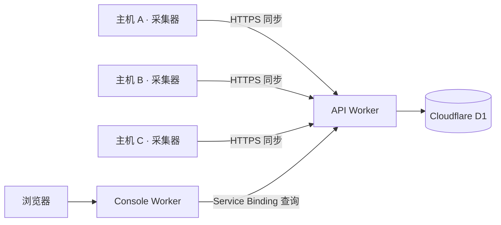

# Tokscale Serverless

基于 [Tokscale](https://github.com/junhoyeo/tokscale) 的跨主机 AI 编程工具用量统计与同步服务。

本项目复用 Tokscale 的 `tokscale-core`，解析各台主机上的会话记录、统计 token 用量，并在此基础上提供**跨主机数据同步、云端聚合存储和统一的网页统计面板**。服务端部署于 Cloudflare Workers 和 D1，采集器运行在用户自己的 Linux、macOS 或 Windows 主机上。

## 功能

- **跨主机统计**：集中查看多台电脑、开发服务器上的用量，按设备、客户端、模型和日期分析。
- **自动采集与同步**：首次输入 Worker 地址和 token，验证后保存；后续启动自动读取配置，默认每 60 秒扫描并同步。
- **可自行部署**：API、数据库和控制台运行在自己的 Cloudflare 账号下，通过共享 token 接收设备上报。
- **多平台采集器**：提供 Linux x86_64、Windows x86_64、macOS Intel 和 Apple Silicon 构建目标。
- **本地查询与导出**：提供 HTTP API，支持本机统计查询、聚合数据导出和手动刷新。
- **Qoder 支持**：在上游解析能力之外增加 Qoder 数据源，单独统计 credits，避免与美元费用混合。

支持的数据源以当前锁定版本的 `tokscale-core` 为准。部分客户端需要先按上游说明生成本地缓存或导出数据，采集器读取这些已有数据。

## 项目架构



| 组件 | 目录 | 职责 |
| --- | --- | --- |
| 采集器 | [`client/`](client/) | Rust + Axum，解析本地数据、提供本地 API、定时上报 |
| 云端 API | [`worker/api/`](worker/api/) | 验证身份、接收上报、读写 D1、查询汇总结果 |
| 网页控制台 | [`worker/console/`](worker/console/) | 静态页面与只读代理，通过 Service Binding 查询 API |
| 数据库迁移 | [`worker/api/migrations/`](worker/api/migrations/) | 设备、每日用量和 credits 的表结构 |

控制台通过 **Workers Static Assets** 部署，与 API 是两个独立 Worker，无需另外创建 Cloudflare Pages 项目。

### 数据与同步方式

采集器启动后立即扫描一次，之后按配置间隔重新扫描，并向 `/api/ingest` 上传聚合结果。云端按「设备、日期、客户端、模型」更新统计行，同一设备重复上报不会重复累加。同步失败会记录日志，本地查询仍可使用，下次扫描后再次尝试同步。

上传内容包括 token、费用、消息数量、Qoder credits 等汇总指标，以及设备 ID、名称、主机名、操作系统和架构；不上传原始对话正文。共享 token 通过认证请求头发送，不进入统计数据正文。

每台主机应独立完成首次连接，保留各自生成的设备 ID。不要将一台主机的完整 `device.json` 复制到另一台主机，否则两台主机会被视为同一设备。当前同步不会自动删除本次扫描中缺失的云端历史行，也不对不同主机上的同一份会话做全局去重。

## 快速开始：连接采集器

先按下文部署云端，准备好 **API Worker 地址**和 `INGEST_TOKEN`。已有部署时，可直接从这里开始。

### 获取程序

从本仓库的 GitHub Releases 下载对应平台的程序；尚未发布版本时，可以在成功的 GitHub Actions 构建中下载 artifact。

| 平台 | 压缩包 |
| --- | --- |
| Linux x86_64 | `tokscale-client-x86_64-unknown-linux-musl.tar.gz` |
| Windows x86_64 | `tokscale-client-x86_64-pc-windows-msvc.zip` |
| macOS Apple Silicon | `tokscale-client-aarch64-apple-darwin.tar.gz` |
| macOS Intel | `tokscale-client-x86_64-apple-darwin.tar.gz` |

Linux 使用 musl 静态链接，Windows 使用静态 MSVC CRT；macOS 最低部署版本设为 11.0。运行预编译采集器无需安装 Rust 或 Node.js。

### 首次连接

Linux / macOS：

```bash
./tokscale-client connect https://your-api.example.com
./tokscale-client run
```

Windows PowerShell：

```powershell
.\tokscale-client.exe connect https://your-api.example.com
.\tokscale-client.exe run
```

将示例地址替换为自己的 API Worker 地址，输入部署时设置的 `INGEST_TOKEN`。地址可以是 Worker 根地址或完整的 `/api/ingest` 地址。`connect` 验证成功后保存配置并退出，随后执行 `run` 开始采集。token 输入不回显。

也可以在终端不带参数启动：未配置连接时会交互式询问地址和 token，成功后直接进入采集。后续启动使用已保存的配置，无需再次输入。

| 命令 | 行为 |
| --- | --- |
| `connect [WORKER_URL]` | 验证并保存连接，也用于修改地址或 token；失败时保留旧配置 |
| `run` | 使用已有连接持续采集、同步；配置缺失时退出，不等待交互输入 |
| `local` | 仅采集和提供本地 API，忽略云端连接 |
| `--help` | 显示命令说明和当前配置文件路径 |

为其他主机重复上述连接步骤，使用同一个 API 地址和 token，即可在控制台统一查看。

## 部署到 Cloudflare

本项目将发布流程分开：**GitHub Actions 构建 Rust 采集器，Cloudflare Workers Builds 构建并部署云端服务**。部署者使用自己的 Cloudflare 账号、D1 数据库和 `INGEST_TOKEN`，无需在 GitHub 中配置 Cloudflare 部署凭据。先按下面的步骤完成首次部署，再连接仓库开启自动构建。

### 1. 准备账号与工具

需要一个可使用 Workers、D1 的 Cloudflare 账号，以及 Node.js 24 和 npm。只有从源码编译采集器时才需要 Rust。

计划使用自动构建时，先将本仓库 fork 到自己的 GitHub 账号。获取代码后，在**仓库根目录**安装依赖，再进入 `worker` 目录：

```bash
npm --prefix worker ci
cd worker
npx wrangler login
npx wrangler whoami
```

后续 Cloudflare 命令均在 **`worker/` 目录**执行。`login` 使用浏览器完成账号授权，`whoami` 用于核对目标账号；有多个账号时，可在两份 Wrangler 配置中填写目标 `account_id`。

### 2. 创建 D1 数据库

```bash
npx wrangler d1 create tokscale-serverless --config api/wrangler.jsonc
```

记录命令返回的 `database_id`。已有数据库时可以复用对应的名称和 ID，无需重新创建。创建与迁移命令的说明见 [Cloudflare D1 文档](https://developers.cloudflare.com/d1/wrangler-commands/)。

### 3. 配置两个 Worker

仓库中的 Wrangler 文件包含现有部署的域名和数据库 ID。首次部署到自己的账号时，需要替换这些值。下面给出使用 `workers.dev` 域名的完整最小配置。

将 [`api/wrangler.jsonc`](worker/api/wrangler.jsonc) 改为以下内容，并填入上一步返回的数据库 ID：

```jsonc
{
  "$schema": "../node_modules/wrangler/config-schema.json",
  "name": "tokscale-serverless-api",
  "main": "./src/index.ts",
  "compatibility_date": "2026-09-16",
  "workers_dev": true,
  "routes": [],
  "d1_databases": [
    {
      "binding": "DB",
      "database_name": "tokscale-serverless",
      "database_id": "YOUR_D1_DATABASE_ID",
      "migrations_dir": "migrations"
    }
  ]
}
```

将 [`console/wrangler.jsonc`](worker/console/wrangler.jsonc) 改为：

```jsonc
{
  "$schema": "../node_modules/wrangler/config-schema.json",
  "name": "tokscale-serverless-console",
  "main": "./src/worker.ts",
  "compatibility_date": "2026-09-16",
  "workers_dev": true,
  "routes": [],
  "assets": {
    "directory": "./public",
    "binding": "ASSETS",
    "run_worker_first": ["/api", "/api/*"]
  },
  "services": [
    {
      "binding": "API",
      "service": "tokscale-serverless-api"
    }
  ]
}
```

可以自定义两个 Worker 的 `name`，但控制台的 `services[].service` 必须与 API Worker 的名称完全一致。代码使用的绑定名称 `DB`、`API`、`ASSETS` 应保持不变。`routes: []` 用于清除仓库原有的自定义域名配置。

### 4. 初始化远程数据库

```bash
npx wrangler d1 migrations apply DB --remote --config api/wrangler.jsonc
```

首次执行会创建所需表结构。这里必须使用 `--remote`；`--local` 仅操作开发环境的本地数据库。

### 5. 部署 API 并设置共享 token

```bash
npx wrangler deploy --config api/wrangler.jsonc
npx wrangler secret put INGEST_TOKEN --config api/wrangler.jsonc
```

按提示输入自己选择的共享 token，并保存以供控制台和各台采集器使用。`INGEST_TOKEN` 未配置时，API 的受保护接口会拒绝请求；`/health` 可公开访问。

记录部署输出的 API URL，例如 `https://tokscale-serverless-api.<你的子域>.workers.dev`。首次使用 Workers 时，按 Wrangler 提示完成 `workers.dev` 子域配置。线上 token 通过 [Worker Secrets](https://developers.cloudflare.com/workers/configuration/secrets/) 设置，不能用本地 `.dev.vars` 代替。

### 6. 部署网页控制台

```bash
npx wrangler deploy --config console/wrangler.jsonc
npx wrangler secret put INGEST_TOKEN --config console/wrangler.jsonc
```

再次输入与 API **完全相同的 token**。API 应先于控制台部署，以便 Service Binding 找到目标 Worker。记录控制台 URL，例如 `https://tokscale-serverless-console.<你的子域>.workers.dev`。

当前控制台会在服务端为无凭据的只读请求附加 token，因此上述最小配置提供的是**公开可读的统计面板**。希望仅自己访问时，在接入设备前按下文配置 Cloudflare Access。token 不会注入浏览器页面，控制台也不代理采集写入接口。

### 7. 验证部署并接入设备

1. 访问 API Worker 的 `/health`，应返回 `{"status":"ok"}`。这一步仅检查服务存活。
2. 在采集主机上执行 `tokscale-client connect <API_URL>`，输入同一个 token；验证成功说明认证可用。
3. 执行 `tokscale-client run`，等待首次采集，日志中应出现 `cloud sync push complete`。
4. 打开控制台 URL，确认能看到设备及用量。没有可识别的本地会话时，用量可以为空。

采集器连接的是 **API Worker URL**；浏览器访问的是 **Console Worker URL**。

### 8. 开启 Cloudflare 原生自动构建

首次部署完成后，分别进入 Cloudflare 控制台中的两个 Worker，打开 **Settings → Builds → Connect**，授权 Cloudflare GitHub App 访问自己的 fork，并连接同一个仓库。后续推送由 [Workers Builds](https://developers.cloudflare.com/workers/ci-cd/builds/) 在 Cloudflare 内完成检查、构建和部署。

按下表配置两个 Worker。若修改过 Worker 名称，控制台名称必须与对应 `wrangler.jsonc` 中的 `name` 一致；控制台 Worker 的 Service Binding 也需指向自己的 API Worker。

| 设置 | API Worker | Console Worker |
| --- | --- | --- |
| 生产分支 | `main` | `main` |
| Root directory | `worker/api` | `worker/console` |
| Build command | `npm --prefix .. ci && npm --prefix .. run check && npm --prefix .. run build:api` | `npm --prefix .. ci && npm --prefix .. run check && npm --prefix .. run build:console` |
| Deploy command | `npm --prefix .. run deploy:api` | `npm --prefix .. run deploy:console` |
| Build variable：`NODE_VERSION` | `24` | `24` |
| Build variable：`SKIP_DEPENDENCY_INSTALL` | `1` | `1` |
| 非生产分支构建 | 关闭 | 关闭 |

每个 Worker 的根目录都包含自己的 Wrangler 配置；共享的 `package.json`、锁文件和测试配置位于上一级 `worker/`，所以命令使用 `npm --prefix ..`。这是本仓库的[多 Worker 构建布局](https://developers.cloudflare.com/workers/ci-cd/builds/advanced-setups/)。`SKIP_DEPENDENCY_INSTALL=1` 关闭平台默认安装，改由构建命令中的 `npm ci` 严格使用锁文件；Node 版本和该变量均在 **Build variables and secrets** 中设置，详见[构建镜像配置](https://developers.cloudflare.com/workers/ci-cd/builds/build-image/)。

在 Builds 的 API token 设置中，可以选择由 Cloudflare 自动生成并管理的 token。API 的部署命令还会执行远程 D1 迁移，因此其构建 token 需要目标账号的 **D1 → Edit** 权限；可在 Cloudflare 的 **My Profile → API Tokens** 中调整，或选择已有的合适 token。构建鉴权留在 Cloudflare 内，不需要复制到 GitHub。参见[构建 token 配置](https://developers.cloudflare.com/workers/ci-cd/builds/configuration/#api-token)。

`INGEST_TOKEN` 与上述部署 token 用途不同：它用于采集器和 API 之间的认证，应在两个 Worker 的 **Settings → Variables and Secrets** 中设置为相同的运行时 Secret，或使用前面的 `wrangler secret put` 命令。构建过程不需要它，不要把它放进源码、GitHub Actions 或 Build variables。之前已经设置的 Worker Secret 在普通代码部署时会保留。

保存后推送一次提交，在两个 Worker 的 Builds 页面查看结果。`check` 依次执行 TypeScript 检查、本地 D1 迁移验证和 Worker 测试；`build:api` / `build:console` 只打包，不发布。全部成功后才执行对应的部署命令；API 会先迁移远程 D1，再部署代码。后续数据库迁移应兼容仍在运行的旧版本代码。两个 Worker 独立构建，不保证先后顺序，跨 Worker 的接口更新也应保持兼容。

### 自定义域名与访问控制

使用自定义域名时，域名对应的 zone 需在自己的 Cloudflare 账号中。将两个配置里的 `routes` 分别设置为自己的域名，然后重新部署。API 的配置示例：

```jsonc
"routes": [
  { "pattern": "usage-api.example.com", "custom_domain": true }
]
```

控制台可使用 `usage.example.com`。Cloudflare 会为 [Worker Custom Domain](https://developers.cloudflare.com/workers/configuration/routing/custom-domains/) 配置对应路由及证书；若域名已有冲突的 DNS 记录，先处理冲突。

如需私有面板：

1. 在 Cloudflare Zero Trust 中为控制台域名创建 [Access 自托管应用](https://developers.cloudflare.com/cloudflare-one/access-controls/applications/http-apps/self-hosted-public-app/)，配置允许访问的用户。
2. 获取 Access team domain 和该应用的 AUD，在 API Worker 配置中加入以下 `vars`，使用真实值替换占位内容：

   ```jsonc
   "vars": {
     "ACCESS_TEAM_DOMAIN": "https://YOUR_TEAM.cloudflareaccess.com",
     "ACCESS_AUD": "YOUR_ACCESS_APPLICATION_AUD"
   }
   ```

3. 控制台使用自定义域名后，将其 `workers_dev` 设为 `false`，并设置 `preview_urls: false`，避免其他公开入口绕过控制台域名上的 Access 策略；重新部署两个 Worker。
4. 使用未登录的浏览器验证访问需要认证。API 保留 bearer token 认证，采集器继续通过 API 地址同步；只配置 API 的 `vars` 本身不会为控制台建立访问策略。

采集器目前使用 bearer token，不提供浏览器登录流程；不要将仅允许交互式登录的 Access 策略直接套在采集入口上。

### 后续更新

已开启 Workers Builds 时，将更改推送到连接仓库的 `main`，由 Cloudflare 自动更新两个 Worker。若仍使用手动部署，在 `worker/` 目录执行：

```bash
npm ci
npm run check
npm run deploy:api
npm run deploy:console
```

普通代码更新无需重新设置 token。更换 token 时，两个 Worker 和每台采集器都需要更新；采集器可重新执行 `connect`。

## 采集器配置

### 配置文件

设备身份、Worker 地址、token 和采集间隔统一保存在 `device.json`：

| 系统 | 默认位置 |
| --- | --- |
| Linux | `$XDG_CONFIG_HOME/tokscale/device.json`；未设置时为 `~/.config/tokscale/device.json` |
| macOS | `~/.config/tokscale/device.json` |
| Windows | 系统 Roaming AppData 下的 `tokscale\device.json`，通常为 `%APPDATA%\tokscale\device.json` |

连接字段为 `syncUrl`、`syncToken`、`refreshIntervalSecs`；已有的 `id`、`name`、`createdAt` 在连接更新时保留。Linux/macOS 保存权限为 `600`，Windows 使用用户配置目录的文件权限。

三端都支持使用 `TOKSCALE_CONFIG_DIR` 指定配置目录，使用 `TOKSCALE_HOME` 指定扫描主目录。路径支持中文和空格，建议使用绝对路径；配置变更后重启采集器。`--help` 可查看实际配置位置。

### 环境变量

| 变量 | 用途与默认行为 |
| --- | --- |
| `BIND_ADDR` | 本地 API 监听地址，默认 `127.0.0.1:8788` |
| `TOKSCALE_CONFIG_DIR` | 设备配置、连接配置和上游缓存目录 |
| `TOKSCALE_HOME` | 扫描主目录，默认当前用户主目录 |
| `TOKSCALE_CLIENTS` | 可选，逗号分隔的客户端列表，如 `claude,codex,qoder` |
| `TOKSCALE_PRICING` | `cached`（默认）、`remote` 或 `off` |
| `TOKSCALE_API_TOKEN` | 可选，保护本地 `/api/*`；与云端 `INGEST_TOKEN` 用途不同 |
| `REFRESH_INTERVAL_SECS` | 覆盖采集间隔；首次连接默认 `60`，`0` 表示关闭定时扫描 |
| `SYNC_URL` / `SYNC_TOKEN` | 覆盖已保存的连接；覆盖 URL 时需同时提供 token；空 `SYNC_URL` 关闭同步 |
| `TOKSCALE_USE_ENV_ROOTS` | 默认 `true`；设为 `false` 后忽略客户端来源目录的环境变量覆盖 |
| `TOKSCALE_DEVICE_ID` / `TOKSCALE_DEVICE_NAME` | 可选，覆盖设备 ID 或显示名称；通常保留自动生成的 ID |
| `TOKSCALE_QODER_COEFFS` | 可选，指定 Qoder 估算系数文件；否则读取配置目录中的 `qoder-coeffs.json` |

环境变量优先于已保存的配置。直接运行时的覆盖不会写入文件；执行 `connect` 时提供的连接和间隔参数会在验证成功后保存。仅本地采集且未指定间隔时，默认只在启动时扫描一次。

价格默认从本地缓存加载；首次没有缓存时，可使用 `TOKSCALE_PRICING=remote` 获取价格。费用属于用量估算，不等同于服务商账单；部分缺少真实 token 信息的 Qoder 记录会按 credits 估算。

Qoder 支持系统应用数据目录及 `.qoder/projects` 等会话目录。非标准安装可通过 `QODER_DB_PATH`、`QODER_CN_DB_PATH`、`QODER_HOME`、`QODER_CN_HOME`、`QODER_PROJECTS_DIR`、`QODER_CN_PROJECTS_DIR` 指定数据来源。

### 后台运行

Linux 提供 [systemd 用户服务示例](client/systemd/tokscale-client.service)。在仓库根目录执行以下命令，将 `./tokscale-client` 替换为已下载或编译的程序路径：

```bash
install -Dm755 ./tokscale-client "$HOME/.local/bin/tokscale-client"
"$HOME/.local/bin/tokscale-client" connect https://your-api.example.com
install -Dm644 client/systemd/tokscale-client.service "$HOME/.config/systemd/user/tokscale-client.service"
systemctl --user daemon-reload
systemctl --user enable --now tokscale-client.service
journalctl --user -u tokscale-client.service -f
```

已经连接过的用户可以跳过 `connect`。如需无需登录也在开机后运行，可启用 `loginctl enable-linger "$USER"`。服务与首次连接应使用相同用户；自定义过 `TOKSCALE_CONFIG_DIR` 时，需在服务中配置相同值。

macOS 可通过 launchd 启动 `run`，Windows 可通过任务计划程序启动 `run`。Windows 产物是控制台程序，不能直接用 `sc.exe create` 注册为原生 Windows 服务。

## 本地开发

### 开发依赖

- Rust 1.98，由 [`rust-toolchain.toml`](rust-toolchain.toml) 指定。
- Node.js 24 和 npm；使用 nvm 时可在仓库根目录运行 `nvm install`。
- 平台对应的 C/C++ 构建工具。Linux 还需要 `make`、`pkg-config` 和 Perl；macOS 使用 Xcode Command Line Tools，Windows 使用 MSVC C++ Build Tools。

在仓库根目录安装依赖并构建采集器：

```bash
npm --prefix worker ci
cargo build --locked -p tokscale-client
```

首次开发时，将 `worker/api/.dev.vars.example` 和 `worker/console/.dev.vars.example` 分别复制为同目录下的 `.dev.vars`，并将两份文件的 `INGEST_TOKEN` 设置为相同的本地开发 token。已有文件时保留原配置。

```bash
npm --prefix worker run db:migrate
```

该命令只初始化本地 D1，不需要 Cloudflare 登录，也不会修改线上数据库。

### 启动服务

在仓库根目录分别打开终端：

```bash
# API
npm --prefix worker run dev -- --ip 127.0.0.1 --port 18787
```

```bash
# 控制台
npm --prefix worker run dev:console
```

```bash
# 采集器：输入本地开发 token
cargo run --locked -p tokscale-client -- connect http://127.0.0.1:18787
cargo run --locked -p tokscale-client -- run
```

此时 API 为 `http://127.0.0.1:18787`，控制台为 `http://127.0.0.1:8789`，采集器本地 API 为 `http://127.0.0.1:8788`。API 与控制台同时运行时，Wrangler 会连接本地 Service Binding。开发连接会覆盖当前配置中的连接地址；需要与生产配置并存时，在执行 `connect` 和 `run` 的终端中设置独立的 `TOKSCALE_CONFIG_DIR`。

只查看本机统计可执行 `cargo run --locked -p tokscale-client -- local`。客户端查询接口包括 `/health`、`/api/summary`、`/api/daily`、`/api/models`、`/api/clients`、`/api/sessions`、`/api/export`，以及用于手动扫描的 `POST /api/refresh`。

### 验证与发布

```bash
cargo fmt --all -- --check
cargo clippy --workspace --all-targets --locked -- -D warnings
cargo test --workspace --locked
npm --prefix worker run check
npm --prefix worker run build
```

[`build.yml`](.github/workflows/build.yml) 包含独立的格式和 Clippy 检查，并在四个目标系统/架构上运行 release 模式测试、构建和打包。推送 `v*` 标签时，只有检查和全部平台构建都通过，才会发布 GitHub Release，并附带 `SHA256SUMS` 校验文件。该工作流只发布采集器，不会自动部署 Cloudflare 服务。

工作流使用完整 commit SHA 固定 Action，由 Dependabot 每周检查更新。Rust 缓存区分目标平台和编译参数，只有主分支保存缓存。Action 自带的 Node.js 运行环境仅用于 GitHub CI，下载后的采集器不需要安装 Node.js。

云端服务使用上文的 Cloudflare Workers Builds，构建环境为 Node.js 24。`npm --prefix worker run build` 可在本地生成两个 Worker 的 bundle，输出位于 `worker/dist/`；该命令使用 Wrangler `--dry-run`，不会部署线上服务。`check` 只使用本地数据库，`deploy:api` 则会迁移远程 D1 并部署 API，`deploy:console` 部署控制台。

采集器构建包只包含可执行文件。用户配置在运行时创建；`.dev.vars`、Wrangler 本地数据库和构建目录已被 Git 忽略。采集器统计快照保存在内存，上游解析器使用本地缓存，跨主机历史汇总保存在 D1。

## 常见问题

| 现象 | 排查方式 |
| --- | --- |
| `/health` 正常，但连接返回 `401` | 核对 API 的 `INGEST_TOKEN` 与采集器输入是否一致，确认使用 API 地址 |
| API 返回 `auth_not_configured` | 在 API Worker 上设置 `INGEST_TOKEN` secret，本地 `.dev.vars` 不会作为线上 secret 使用 |
| 控制台查询返回 `401` | 核对两个 Worker 的 token；使用 Access 时核对 team domain 和 AUD |
| 提示找不到表 | 确认对正确的 D1 执行了 `migrations apply DB --remote` |
| 控制台提示找不到 Service Binding 目标 | 先部署 API，核对控制台的 `services[].service` 与 API Worker 名称 |
| 后台运行找不到配置或数据 | 检查运行用户、`TOKSCALE_CONFIG_DIR`、`TOKSCALE_HOME` 和来源目录权限 |
| 用量存在但费用不完整 | 检查价格缓存，必要时使用 `TOKSCALE_PRICING=remote` 后重新扫描 |

## 上游项目与致谢

本项目建立在 [junhoyeo/tokscale](https://github.com/junhoyeo/tokscale) 的工作之上。感谢 Junho Yeo 及 Tokscale 社区提供会话解析、token 统计、聚合与定价能力。

采集器直接依赖上游 `tokscale-core`，当前锁定版本见 [`client/Cargo.toml`](client/Cargo.toml)。本项目在这一基础上实现面向自行部署的跨主机同步、Cloudflare Workers/D1 存储和统一统计控制台，并补充 Qoder 数据源及后台运行支持。

上游 Tokscale 使用 [MIT License](https://github.com/junhoyeo/tokscale/blob/main/LICENSE)，其代码版权和许可声明归原作者及贡献者所有。
