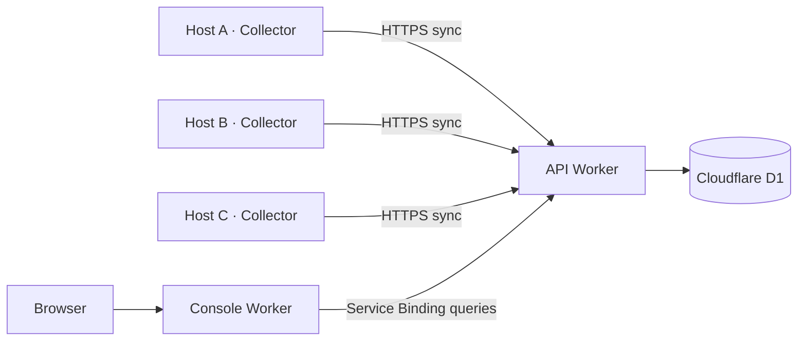

# Tokscale Serverless

English | [简体中文](README_CN.md)

Usage tracking and synchronization for AI coding tools across multiple hosts, built on [Tokscale](https://github.com/junhoyeo/tokscale).

This project uses Tokscale's `tokscale-core` to parse local session records and measure token usage, adding **synchronization across hosts, aggregated cloud storage, and a unified web dashboard**. The backend runs on Cloudflare Workers and D1, while the collector runs on your own Linux, macOS, or Windows machines.

## Features

- **Usage across hosts**: View usage from multiple computers and development servers in one place, with breakdowns by device, client, model, and date.
- **Automatic collection and synchronization**: Enter the Worker URL and token once. The collector verifies and saves the connection, then uses it on subsequent launches. By default, it scans and synchronizes every 60 seconds.
- **Self-hosted deployment**: Run the API, database, and console in your own Cloudflare account, with a shared token authenticating device uploads.
- **Cross-platform collector**: Build targets are available for Linux x86_64, Windows x86_64, macOS Intel, and Apple Silicon.
- **Local queries and exports**: An HTTP API provides local usage queries, aggregated data exports, and manual refreshes.
- **Qoder support**: An additional Qoder data source extends upstream parsing support. Credits are tracked separately from costs in USD.

Supported data sources depend on the pinned version of `tokscale-core`. Some clients require you to generate local caches or exports using the upstream instructions before the collector can read them.

## Architecture



| Component | Directory | Responsibilities |
| --- | --- | --- |
| Collector | [`client/`](client/) | Rust + Axum; parses local data, serves a local API, and uploads on a schedule |
| Cloud API | [`worker/api/`](worker/api/) | Authenticates requests, receives uploads, reads and writes D1, and queries aggregated usage |
| Web console | [`worker/console/`](worker/console/) | Static pages and a read-only proxy that queries the API through a Service Binding |
| Database migrations | [`worker/api/migrations/`](worker/api/migrations/) | Schemas for devices, daily usage, and credits |

The console uses **Workers Static Assets**. It and the API are separate Workers; no separate Cloudflare Pages project is required.

### Data and synchronization

The collector scans once at startup, then rescans at the configured interval and uploads aggregated results to `/api/ingest`. The backend updates rows by device, date, client, and model, so repeated uploads from the same device do not double-count usage. Synchronization failures are logged; local queries remain available, and synchronization is retried after the next scan.

Uploads contain summary metrics such as token usage, costs, message counts, and Qoder credits, along with the device ID, name, hostname, operating system, and architecture. Raw conversation text is not uploaded. The shared token is sent in an authentication header, not in the statistics payload.

Complete the initial connection separately on each host so that each retains its own generated device ID. Do not copy an entire `device.json` from one host to another, as both hosts would be treated as the same device. Synchronization currently does not delete historical cloud rows that are absent from a later scan, nor does it deduplicate copies of the same session across different hosts.

## Quick start: connect a collector

Deploy the backend as described below and have your **API Worker URL** and `INGEST_TOKEN` ready. If you already have a deployment, start here.

### Download the collector

Download the archive for your platform from this repository's GitHub Releases. If no release is available yet, download an artifact from a successful GitHub Actions build.

| Platform | Archive |
| --- | --- |
| Linux x86_64 | `tokscale-client-x86_64-unknown-linux-musl.tar.gz` |
| Windows x86_64 | `tokscale-client-x86_64-pc-windows-msvc.zip` |
| macOS Apple Silicon | `tokscale-client-aarch64-apple-darwin.tar.gz` |
| macOS Intel | `tokscale-client-x86_64-apple-darwin.tar.gz` |

Linux builds link statically against musl, and Windows builds use the static MSVC CRT. The minimum macOS deployment target is 11.0. Prebuilt collectors require neither Rust nor Node.js to run.

### Initial connection

Linux / macOS:

```bash
./tokscale-client connect https://your-api.example.com
./tokscale-client run
```

Windows PowerShell:

```powershell
.\tokscale-client.exe connect https://your-api.example.com
.\tokscale-client.exe run
```

Replace the example URL with your API Worker URL and enter the `INGEST_TOKEN` configured during deployment. You can use either the Worker root URL or the full `/api/ingest` URL. After successful verification, `connect` saves the configuration and exits. Run `run` to start collecting. Token input is hidden.

You can also launch the collector in a terminal without arguments. If no connection is configured, it prompts for the URL and token, then starts collecting immediately after verification. Subsequent launches use the saved configuration without prompting again.

| Command | Behavior |
| --- | --- |
| `connect [WORKER_URL]` | Verifies and saves a connection; also updates the URL or token. Existing configuration is preserved if verification fails |
| `run` | Continuously collects and synchronizes using the saved connection; exits without prompting if configuration is missing |
| `local` | Collects data and serves the local API only, ignoring the cloud connection |
| `--help` | Shows command help and the current configuration file path |

Repeat these steps on other hosts using the same API URL and token to view them together in the console.

## Deploy to Cloudflare

**GitHub Actions builds the Rust collector; Cloudflare Workers Builds builds and deploys the cloud services.** Each deployer uses their own Cloudflare account, D1 database, and `INGEST_TOKEN`. No Cloudflare deployment credentials need to be configured in GitHub. Complete the initial deployment below, then connect your repository to enable automatic builds.

### 1. Prepare your account and tools

You need a Cloudflare account with access to Workers and D1, plus Node.js 24 and npm. Rust is only required if you build the collector from source.

If you plan to use automatic builds, first fork this repository into your own GitHub account. After checking out the code, install dependencies from the **repository root**, then enter the `worker` directory:

```bash
npm --prefix worker ci
cd worker
npx wrangler login
npx wrangler whoami
```

Run all subsequent Cloudflare commands from **`worker/`**. The `login` command opens a browser to authorize your account, and `whoami` lets you verify the target account. If you have multiple accounts, you can specify the target `account_id` in both Wrangler configuration files.

### 2. Create a D1 database

```bash
npx wrangler d1 create tokscale-serverless --config api/wrangler.jsonc
```

If the `tokscale-serverless` database already exists, skip creation and reuse it. Keep its name in `database_name`; you do not need to copy its ID into the repository or set a `D1_DATABASE_ID` build variable. If Wrangler offers to write the newly created database ID into your configuration, decline or remove that field afterward. See the [Cloudflare D1 documentation](https://developers.cloudflare.com/d1/wrangler-commands/) for database creation and migration commands.

### 3. Configure both Workers

The Wrangler files in this repository use `workers.dev` by default, with no custom domains or account-specific resource IDs. The D1 configuration declares the `DB` binding and the `tokscale-serverless` database name, omitting `database_id`. With the locked Wrangler version, deployment reuses an existing `DB` binding when its database name matches, or resolves the existing database by name. Remote migration commands also resolve this name. Keep the dashboard binding and `database_name` consistent if you use a different database. See [Wrangler resource provisioning](https://developers.cloudflare.com/workers/wrangler/configuration/#automatic-provisioning).

The following is a minimal [`api/wrangler.jsonc`](worker/api/wrangler.jsonc) configuration:

```jsonc
{
  "$schema": "../node_modules/wrangler/config-schema.json",
  "name": "tokscale-serverless-api",
  "main": "./src/index.ts",
  "compatibility_date": "2026-09-16",
  "workers_dev": true,
  "d1_databases": [
    {
      "binding": "DB",
      "database_name": "tokscale-serverless",
      "migrations_dir": "migrations"
    }
  ]
}
```

Replace [`console/wrangler.jsonc`](worker/console/wrangler.jsonc) with:

```jsonc
{
  "$schema": "../node_modules/wrangler/config-schema.json",
  "name": "tokscale-serverless-console",
  "main": "./src/worker.ts",
  "compatibility_date": "2026-09-16",
  "workers_dev": true,
  "assets": {
    "directory": "./public",
    "binding": "ASSETS",
    "run_worker_first": ["/api", "/api/*"]
  },
  "services": [
    {
      "binding": "API",
      "service": "tokscale-serverless-api"
    }
  ]
}
```

You can customize each Worker's `name`, but the console's `services[].service` must exactly match the API Worker's name. Keep the binding names `DB`, `API`, and `ASSETS` unchanged, as the code uses them. Leave both `route` and `routes` unset; manage custom domains in the Cloudflare dashboard.

### 4. Initialize the remote database

```bash
npx wrangler d1 migrations apply DB --remote --config api/wrangler.jsonc
```

The first run creates the required tables. Use `--remote` here; `--local` only modifies the local development database.

### 5. Deploy the API and set the shared token

```bash
npx wrangler deploy --config api/wrangler.jsonc
npx wrangler secret put INGEST_TOKEN --config api/wrangler.jsonc
```

Enter a shared token of your choice when prompted, and save it for the console and each collector. Protected API endpoints reject requests if `INGEST_TOKEN` is not configured; `/health` remains publicly accessible.

Record the API URL printed during deployment, such as `https://tokscale-serverless-api.<your-subdomain>.workers.dev`. If this is your first time using Workers, follow Wrangler's prompts to configure your `workers.dev` subdomain. Configure the production token through [Worker Secrets](https://developers.cloudflare.com/workers/configuration/secrets/); a local `.dev.vars` file does not configure production secrets.

### 6. Deploy the web console

```bash
npx wrangler deploy --config console/wrangler.jsonc
npx wrangler secret put INGEST_TOKEN --config console/wrangler.jsonc
```

Enter **exactly the same token** as for the API. Deploy the API before the console so that the Service Binding can find its target Worker. Record the console URL, such as `https://tokscale-serverless-console.<your-subdomain>.workers.dev`.

The console currently adds the token on the server for read-only requests that have no credentials, so this minimal configuration provides a **publicly readable statistics dashboard**. To restrict access, configure Cloudflare Access as described below before connecting devices. The token is not injected into browser pages, and the console does not proxy ingestion requests.

### 7. Verify the deployment and connect devices

1. Visit `/health` on the API Worker. It should return `{"status":"ok"}`. This checks service liveness only.
2. On a collector host, run `tokscale-client connect <API_URL>` and enter the same token. Successful verification confirms that authentication works.
3. Run `tokscale-client run` and wait for the first collection. The logs should include `cloud sync push complete`.
4. Open the console URL and confirm that devices and usage appear. Usage may be empty if there are no recognized local sessions.

Collectors connect to the **API Worker URL**. Open the **Console Worker URL** in your browser.

### 8. Enable automatic builds in Cloudflare

After the initial deployment, open each Worker in the Cloudflare dashboard and go to **Settings → Builds → Connect**. Authorize the Cloudflare GitHub App to access your fork, and connect both Workers to the same repository. Subsequent pushes trigger checks, builds, and deployments within Cloudflare through [Workers Builds](https://developers.cloudflare.com/workers/ci-cd/builds/).

Configure both Workers as follows. If you changed their names, each name in the dashboard must match `name` in its corresponding `wrangler.jsonc`. The console Worker's Service Binding must also point to your API Worker.

| Setting | API Worker | Console Worker |
| --- | --- | --- |
| Production branch | `main` | `main` |
| Root directory | `worker/api` | `worker/console` |
| Build command | `npm --prefix .. ci && npm --prefix .. run check && npm --prefix .. run build:api` | `npm --prefix .. ci && npm --prefix .. run check && npm --prefix .. run build:console` |
| Deploy command | `npm --prefix .. run deploy:api` | `npm --prefix .. run deploy:console` |
| Build variable: `NODE_VERSION` | `24` | `24` |
| Build variable: `SKIP_DEPENDENCY_INSTALL` | `1` | `1` |
| Builds for non-production branches | Disabled | Disabled |

Each Worker's root directory contains its own Wrangler configuration. The shared `package.json`, lockfile, and test configuration live one level above, in `worker/`, so the commands use `npm --prefix ..`. This follows a [multiple-Worker build layout](https://developers.cloudflare.com/workers/ci-cd/builds/advanced-setups/). `SKIP_DEPENDENCY_INSTALL=1` disables the platform's automatic dependency installation; the build command instead uses `npm ci` to install from the lockfile. Set this variable and the Node.js version under **Build variables and secrets**. See the [build image configuration](https://developers.cloudflare.com/workers/ci-cd/builds/build-image/) for details.

In the Builds API token settings, you can select a token automatically generated and managed by Cloudflare. The API deployment command also runs remote D1 migrations, so its build token needs **D1 → Edit** permission for the target account. Adjust this under **My Profile → API Tokens**, or select an existing token with the appropriate permissions. Build credentials stay in Cloudflare and do not need to be copied to GitHub. See the [build token configuration](https://developers.cloudflare.com/workers/ci-cd/builds/configuration/#api-token).

`INGEST_TOKEN` serves a different purpose from the deployment token: it authenticates requests between collectors and the API. Set it to the same runtime Secret on both Workers under **Settings → Variables and Secrets**, or use the earlier `wrangler secret put` commands. It is not needed during builds; keep it out of source code, GitHub Actions, and Build variables. Existing Worker Secrets are retained during ordinary code deployments.

Save the settings, push a commit, and check the Builds page for each Worker. The `check` command runs TypeScript checks, local D1 migration validation, and Worker tests in order. The `build:api` and `build:console` commands bundle the Workers without deploying them. The corresponding deployment command runs only after these steps succeed; the API command migrates remote D1 before deploying code. Future database migrations should remain compatible with the previous code version while it is still running. The two Workers build independently with no guaranteed deployment order, so changes to interfaces between them should also remain backward compatible.

### Custom domains and access control

To use custom domains, their zone must be in your Cloudflare account. Open each Worker in the dashboard and select **Settings → Domains & Routes → Add → Custom Domain**. Bind your API domain to the API Worker and your console domain to the Console Worker. Existing bindings can be kept as they are.

No `CUSTOM_DOMAIN` build variable is required. Keep personal domains out of the repository and leave `route` and `routes` unset in both Wrangler files. The default configuration also enables `workers.dev`; to serve only through your custom domains, set `workers_dev` to `false` in the corresponding configuration.

Cloudflare configures routing and certificates for a [Worker Custom Domain](https://developers.cloudflare.com/workers/configuration/routing/custom-domains/). Resolve any conflicting DNS records for the domain first.

To make the dashboard private:

1. In Cloudflare Zero Trust, create an [Access self-hosted application](https://developers.cloudflare.com/cloudflare-one/access-controls/applications/http-apps/self-hosted-public-app/) for the console domain and configure which users may access it.
2. Obtain your Access team domain and the application's AUD. Add the following `vars` to the API Worker configuration, replacing the placeholders with your values:

   ```jsonc
   "vars": {
     "ACCESS_TEAM_DOMAIN": "https://YOUR_TEAM.cloudflareaccess.com",
     "ACCESS_AUD": "YOUR_ACCESS_APPLICATION_AUD"
   }
   ```

3. Once the console uses a custom domain, set its `workers_dev` to `false` and add `preview_urls: false` to prevent other public entry points from bypassing the Access policy on the console domain. Redeploy both Workers.
4. Verify in a signed-out browser that access requires authentication. The API retains bearer token authentication, so collectors continue synchronizing through the API URL. Setting the API's `vars` alone does not create an access policy for the console.

The collector uses bearer tokens and does not support browser login. Do not apply an Access policy that requires interactive login directly to the ingestion endpoint.

### Subsequent updates

With Workers Builds enabled, push changes to `main` in the connected repository to have Cloudflare update both Workers automatically. For manual deployments, run the following from `worker/`:

```bash
npm ci
npm run check
npm run deploy:api
npm run deploy:console
```

Ordinary code updates do not require resetting the token. When rotating it, update both Workers and every collector. Run `connect` again on collectors to save the new token.

## Collector configuration

### Configuration file

Device identity, Worker URL, token, and collection interval are stored together in `device.json`:

| System | Default location |
| --- | --- |
| Linux | `$XDG_CONFIG_HOME/tokscale/device.json`, or `~/.config/tokscale/device.json` if `XDG_CONFIG_HOME` is unset |
| macOS | `~/.config/tokscale/device.json` |
| Windows | `tokscale\device.json` under the system Roaming AppData directory, usually `%APPDATA%\tokscale\device.json` |

Connection fields are `syncUrl`, `syncToken`, and `refreshIntervalSecs`. Existing `id`, `name`, and `createdAt` values are preserved when the connection is updated. Files are saved with mode `600` on Linux and macOS; Windows uses the permissions of the user's configuration directory.

On all three platforms, use `TOKSCALE_CONFIG_DIR` to select a configuration directory and `TOKSCALE_HOME` to select the home directory to scan. Paths support Unicode characters and spaces; absolute paths are recommended. Restart the collector after changing its configuration. Run `--help` to see the actual configuration path.

### Environment variables

| Variable | Purpose and default behavior |
| --- | --- |
| `BIND_ADDR` | Local API listen address; defaults to `127.0.0.1:8788` |
| `TOKSCALE_CONFIG_DIR` | Directory for device configuration, connection configuration, and upstream caches |
| `TOKSCALE_HOME` | Home directory to scan; defaults to the current user's home directory |
| `TOKSCALE_CLIENTS` | Optional comma-separated list of clients, such as `claude,codex,qoder` |
| `TOKSCALE_PRICING` | `cached` (default), `remote`, or `off` |
| `TOKSCALE_API_TOKEN` | Optional protection for the local `/api/*` endpoints; separate from the cloud `INGEST_TOKEN` |
| `REFRESH_INTERVAL_SECS` | Overrides the collection interval; the initial connection defaults to `60`. Set to `0` to disable periodic scans |
| `SYNC_URL` / `SYNC_TOKEN` | Override the saved connection; overriding the URL also requires a token. An empty `SYNC_URL` disables synchronization |
| `TOKSCALE_USE_ENV_ROOTS` | Defaults to `true`; setting it to `false` ignores environment overrides for client source directories |
| `TOKSCALE_DEVICE_ID` / `TOKSCALE_DEVICE_NAME` | Optional overrides for the device ID or display name; normally retain the generated ID |
| `TOKSCALE_QODER_COEFFS` | Optional path to a Qoder estimation coefficient file; otherwise reads `qoder-coeffs.json` from the configuration directory |

Environment variables take precedence over saved configuration. Runtime overrides are not written to disk. Connection and interval values supplied when running `connect` are saved after successful verification. In local-only mode, if no interval is specified, the collector scans only once at startup.

Prices are loaded from the local cache by default. If no cache exists yet, use `TOKSCALE_PRICING=remote` to fetch prices. Costs are usage estimates and may differ from provider invoices. Some Qoder records without actual token counts are estimated from credits.

Qoder supports system application data directories and session directories such as `.qoder/projects`. For nonstandard installations, specify data sources through `QODER_DB_PATH`, `QODER_CN_DB_PATH`, `QODER_HOME`, `QODER_CN_HOME`, `QODER_PROJECTS_DIR`, or `QODER_CN_PROJECTS_DIR`.

### Run in the background

A [systemd user service example](client/systemd/tokscale-client.service) is provided for Linux. Run the following from the repository root, replacing `./tokscale-client` with the path to your downloaded or compiled binary:

```bash
install -Dm755 ./tokscale-client "$HOME/.local/bin/tokscale-client"
"$HOME/.local/bin/tokscale-client" connect https://your-api.example.com
install -Dm644 client/systemd/tokscale-client.service "$HOME/.config/systemd/user/tokscale-client.service"
systemctl --user daemon-reload
systemctl --user enable --now tokscale-client.service
journalctl --user -u tokscale-client.service -f
```

Skip `connect` if you have already configured the connection. To run the service at boot without logging in, enable lingering with `loginctl enable-linger "$USER"`. Use the same user for the initial connection and the service. If you customized `TOKSCALE_CONFIG_DIR`, set the same value in the service.

On macOS, use launchd to start `run`. On Windows, use Task Scheduler to start `run`. The Windows binary is a console application and cannot be registered directly as a native Windows service with `sc.exe create`.

## Local development

### Prerequisites

- Rust 1.98, as specified in [`rust-toolchain.toml`](rust-toolchain.toml).
- Node.js 24 and npm. With nvm, run `nvm install` from the repository root.
- C/C++ build tools for your platform. Linux also requires `make`, `pkg-config`, and Perl. Use Xcode Command Line Tools on macOS and MSVC C++ Build Tools on Windows.

Install dependencies and build the collector from the repository root:

```bash
npm --prefix worker ci
cargo build --locked -p tokscale-client
```

For initial development setup, copy `worker/api/.dev.vars.example` and `worker/console/.dev.vars.example` to `.dev.vars` in their respective directories. Set `INGEST_TOKEN` to the same local development token in both files. Preserve existing configuration if these files already exist.

```bash
npm --prefix worker run db:migrate
```

This command initializes only the local D1 database. It requires no Cloudflare login and does not modify the production database.

### Start the services

Open separate terminals at the repository root:

```bash
# API
npm --prefix worker run dev -- --ip 127.0.0.1 --port 18787
```

```bash
# Console
npm --prefix worker run dev:console
```

```bash
# Collector: enter the local development token
cargo run --locked -p tokscale-client -- connect http://127.0.0.1:18787
cargo run --locked -p tokscale-client -- run
```

The API is available at `http://127.0.0.1:18787`, the console at `http://127.0.0.1:8789`, and the collector's local API at `http://127.0.0.1:8788`. When both Workers are running, Wrangler connects the local Service Binding. A development connection overwrites the connection URL in the current configuration. To keep development and production configurations separate, set a dedicated `TOKSCALE_CONFIG_DIR` in the terminals running `connect` and `run`.

To view local statistics only, run `cargo run --locked -p tokscale-client -- local`. The collector exposes `/health`, `/api/summary`, `/api/daily`, `/api/models`, `/api/clients`, `/api/sessions`, and `/api/export`, plus `POST /api/refresh` for a manual scan.

### Validation and releases

```bash
cargo fmt --all -- --check
cargo clippy --workspace --all-targets --locked -- -D warnings
cargo test --workspace --locked
npm --prefix worker run check
npm --prefix worker run build
```

[`build.yml`](.github/workflows/build.yml) runs separate formatting and Clippy checks, then tests in release mode, builds, and packages the collector for all four platform and architecture targets. Pushing a `v*` tag publishes a GitHub Release with a `SHA256SUMS` checksum file only after the checks and every platform build succeed. This workflow publishes the collector only; it does not deploy Cloudflare services.

Actions are pinned to full commit SHAs, with Dependabot checking for updates weekly. Rust caches are separated by target platform and compiler flags, and only the main branch saves caches. The Node.js runtime used by Actions is part of GitHub CI; downloaded collectors do not require Node.js.

Cloud services use the Cloudflare Workers Builds setup described above, with Node.js 24 in the build environment. Run `npm --prefix worker run build` locally to bundle both Workers into `worker/dist/`. This uses Wrangler's `--dry-run` and does not deploy production services. The `check` command uses only the local database, while `deploy:api` migrates remote D1 and deploys the API, and `deploy:console` deploys the console.

Collector archives contain only the executable. User configuration is created at runtime. Git ignores `.dev.vars`, Wrangler's local databases, and build directories. Collector statistics snapshots are held in memory, upstream parsers use local caches, and historical summaries across hosts are stored in D1.

## Troubleshooting

| Symptom | What to check |
| --- | --- |
| `/health` succeeds, but connecting returns `401` | Confirm that the collector's token matches the API's `INGEST_TOKEN` and that you are using the API URL |
| The API returns `auth_not_configured` | Set the `INGEST_TOKEN` secret on the API Worker; a local `.dev.vars` file does not configure production secrets |
| Console queries return `401` | Check that both Workers use the same token. If using Access, also check the team domain and AUD |
| A table is missing | Confirm that `migrations apply DB --remote` was run against the correct D1 database |
| The console cannot find its Service Binding target | Deploy the API first and check that the console's `services[].service` matches the API Worker name |
| The background service cannot find configuration or data | Check the running user, `TOKSCALE_CONFIG_DIR`, `TOKSCALE_HOME`, and source directory permissions |
| Usage is present, but costs are incomplete | Check the pricing cache; if needed, use `TOKSCALE_PRICING=remote` and rescan |

## Upstream project and acknowledgments

This project builds on [junhoyeo/tokscale](https://github.com/junhoyeo/tokscale). Thanks to Junho Yeo and the Tokscale community for their work on session parsing, token usage tracking, aggregation, and pricing.

The collector directly depends on the upstream `tokscale-core`; see [`client/Cargo.toml`](client/Cargo.toml) for the pinned version. On top of that foundation, this project provides synchronization across hosts, self-hosted Cloudflare Workers/D1 storage, and a unified usage dashboard, with additional Qoder support and background operation.

Upstream Tokscale is licensed under the [MIT License](https://github.com/junhoyeo/tokscale/blob/main/LICENSE). Its copyright and license notices remain with the original authors and contributors.
