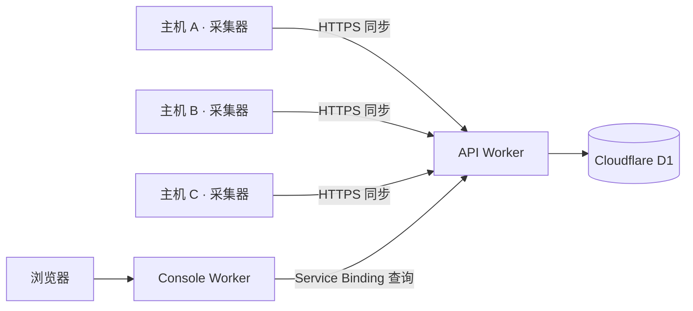

# Tokscale Serverless

基于 [Tokscale](https://github.com/junhoyeo/tokscale) 的跨主机 AI 编程工具用量统计与同步服务。

本项目复用 Tokscale 的 `tokscale-core`，解析各台主机上的会话记录、统计 token 用量，并在此基础上提供**跨主机数据同步、云端聚合存储和统一的网页统计面板**。服务端部署于 Cloudflare Workers 和 D1，采集器运行在用户自己的 Linux、macOS 或 Windows 主机上。

## 功能

- **跨主机统计**：集中查看多台电脑、开发服务器上的用量，按设备、客户端、模型和日期分析。
- **当日用量卡片**：按设备、工具或模型显示小时曲线，与热力图保持筛选同步；点击方块可查看其他天。顶部统一切换所有 token 数字的简写或完整显示。使用 React 和 Recharts，与现有深浅主题保持一致。
- **网页安装入口**：选择系统后下载最新正式版本，或复制安装命令，自动保存连接配置。
- **自动采集与同步**：首次输入 Worker 地址和 token，验证后保存；后续启动自动读取配置，默认每 60 秒扫描并同步。
- **可自行部署**：API、数据库和控制台运行在自己的 Cloudflare 账号下，通过共享 token 接收设备上报。
- **多平台采集器**：提供 Linux x86_64、Windows x86_64、macOS Intel 和 Apple Silicon 构建目标。
- **本地查询与导出**：提供 HTTP API，支持本机统计查询、聚合数据导出和手动刷新。
- **Qoder 支持**：在上游解析能力之外增加 Qoder 数据源，单独统计 credits，避免与美元费用混合。

支持的数据源以当前锁定版本的 `tokscale-core` 为准。部分客户端需要先按上游说明生成本地缓存或导出数据，采集器读取这些已有数据。

## 项目架构



| 组件 | 目录 | 职责 |
| --- | --- | --- |
| 采集器 | [`client/`](client/) | Rust + Axum，解析本地数据、提供本地 API、定时上报 |
| 云端 API | [`worker/api/`](worker/api/) | 验证身份、接收上报、读写 D1、查询汇总结果 |
| 网页控制台 | [`worker/console/`](worker/console/) | 静态统计页面，通过 Service Binding 查询 API，并为 Access 登录用户生成安装命令 |
| 数据库迁移 | [`worker/api/migrations/`](worker/api/migrations/) | 设备、每日/小时用量、credits 和已部署的 API 地址的表结构 |

控制台通过 **Workers Static Assets** 部署，与 API 是两个独立 Worker，无需另外创建 Cloudflare Pages 项目。

### 数据与同步方式

采集器启动后立即扫描一次，之后按配置间隔重新扫描，并向 `/api/ingest` 上传聚合结果。云端按「设备、日期、客户端、模型」更新统计行，同一设备重复上报不会重复累加。同步失败会记录日志，本地查询仍可使用，下次扫描后再次尝试同步。

小时汇总在上述维度上增加「小时（0–23）」，包含输入、输出、缓存读写和推理五类 token。日期与小时沿用各采集主机的本地时区，与热力图一致；不同时区的主机不会被转换到统一时区。旧采集器仍可上报每日总量，升级并同步后可从保留的本地记录补齐小时数据；没有有效时间戳的记录仅计入每日总量。

上传内容包括 token、费用、消息数量、Qoder credits 等汇总指标，以及设备 ID、名称、主机名、操作系统和架构；不上传原始对话正文。共享 token 通过认证请求头发送，不进入统计数据正文。

每台主机应独立完成首次连接，保留各自生成的设备 ID。不要将一台主机的完整 `device.json` 复制到另一台主机，否则两台主机会被视为同一设备。当前同步不会自动删除本次扫描中缺失的云端历史行，也不对不同主机上的同一份会话做全局去重。

## 快速开始：连接采集器

先按下文部署云端，准备好 **API Worker 地址**和 `INGEST_TOKEN`。已有部署时，可直接从这里开始。

### 获取程序

点击**主题按钮旁的下载图标**打开安装弹窗，选择系统和架构后下载最新正式 Release，或复制安装命令：Linux/macOS 使用 Bash，Windows 使用 PowerShell。命令直接包含 API 地址与 `INGEST_TOKEN`，可以重复执行。

安装脚本校验 `SHA256SUMS`，通过 `connect` 保存连接配置，保留已有设备身份。程序安装到 Linux/macOS 的 `~/.local/bin` 或 Windows 的 `%LOCALAPPDATA%\Programs\tokscale`。按终端打印的 `run` 命令开始采集；Linux/macOS 也可执行 `~/.local/bin/tokscale-client service install` 注册[后台服务](#后台运行)。

也可从 [GitHub Releases](https://github.com/HSwift/tokscale-serverless/releases/latest) 下载后按下文手动连接；尚未发布版本时，可以在成功的 GitHub Actions 构建中下载 artifact。

| 平台 | 压缩包 |
| --- | --- |
| Linux x86_64 | `tokscale-client-x86_64-unknown-linux-musl.tar.gz` |
| Windows x86_64 | `tokscale-client-x86_64-pc-windows-msvc.zip` |
| macOS Apple Silicon | `tokscale-client-aarch64-apple-darwin.tar.gz` |
| macOS Intel | `tokscale-client-x86_64-apple-darwin.tar.gz` |

Linux 使用 musl 静态链接，Windows 使用静态 MSVC CRT；macOS 最低部署版本设为 11.0。运行预编译采集器无需安装 Rust 或 Node.js。

### 首次连接

Linux / macOS：

```bash
./tokscale-client connect https://your-api.example.com
./tokscale-client run
```

Windows PowerShell：

```powershell
.\tokscale-client.exe connect https://your-api.example.com
.\tokscale-client.exe run
```

将示例地址替换为自己的 API Worker 地址，输入部署时设置的 `INGEST_TOKEN`。地址可以是 Worker 根地址或完整的 `/api/ingest` 地址。`connect` 验证成功后保存配置并退出，随后执行 `run` 开始采集。token 输入不回显。

也可以在终端不带参数启动：未配置连接时会交互式询问地址和 token，成功后直接进入采集。后续启动使用已保存的配置，无需再次输入。

| 命令 | 行为 |
| --- | --- |
| `connect [WORKER_URL]` | 验证并保存连接，也用于修改地址或 token；失败时保留旧配置 |
| `run` | 使用已有连接持续采集、同步；配置缺失时退出，不等待交互输入 |
| `local` | 仅采集和提供本地 API，忽略云端连接 |
| `service <COMMAND>` | 安装和管理 Linux systemd 用户服务或 macOS LaunchAgent |
| `--help` | 显示命令说明和当前配置文件路径 |

为其他主机重复上述连接步骤，使用同一个 API 地址和 token，即可在控制台统一查看。

## 部署到 Cloudflare

在自己的 Cloudflare 账号中部署两个 Worker 和一个 D1 数据库。**Cloudflare Workers Builds 部署云端服务，GitHub Actions 只构建采集器**；Cloudflare 凭据保留在 Cloudflare 中。

### 1. 准备仓库和数据库

Fork 本仓库。在 Cloudflare 中创建名为 `tokscale-serverless` 的 D1 数据库，已有同名数据库时直接复用。仓库中的 Wrangler 配置已声明 `DB` 绑定，并按名称查找数据库，无需配置 `D1_DATABASE_ID`，也无需将个人数据库 ID 写入 Git。

### 2. 将两个 Worker 连接到 GitHub

在 **Workers & Pages** 中导入自己的 fork，**先创建 API Worker**，等 API 部署成功后再创建 Console Worker。已有 Worker 则进入 **Settings → Builds → Connect**。两者连接同一仓库的 `main` 分支。

| 配置项 | API Worker | Console Worker |
| --- | --- | --- |
| Worker 名称 | `tokscale-serverless-api` | `tokscale-serverless-console` |
| Root directory | `/worker/api/` | `/worker/console/` |
| Build command | `npm --prefix .. ci && npm --prefix .. run check && npm --prefix .. run build:api` | `npm --prefix .. ci && npm --prefix .. run check && npm --prefix .. run build:console` |
| Deploy command | `npm --prefix .. run deploy:api` | `npm --prefix .. run deploy:console` |
| Build variables | `NODE_VERSION=24`、`SKIP_DEPENDENCY_INSTALL=1` | 同左 |

没有单独配置预览资源时，关闭非生产分支构建。保留上述 Worker 名称；如果改名，同时修改对应 Wrangler 的 `name` 和控制台的 `API` Service Binding。

构建 token 可选择 Cloudflare 自动管理的 token 或已有的合适 token。API 的构建 token 除 Worker 部署权限外，还需要 **D1 → Edit**：`deploy:api` 会自动执行数据库迁移。参见 [Workers Builds 配置](https://developers.cloudflare.com/workers/ci-cd/builds/configuration/#api-token)。

连接完成后，推送到 `main` 会自动触发两个 Worker 的检查、构建和部署。

### 3. 设置 token 和域名

分别进入**两个 Worker → Settings → Variables and Secrets**，添加名称为 `INGEST_TOKEN` 的 **Secret**，值必须相同，并保存供采集器使用。这是运行时密钥，不是 Build variable，也不是 Cloudflare 部署 token。

在 **Settings → Domains & Routes → Add → Custom Domain** 中为控制台绑定域名，API 域名按需绑定。控制台需要自定义域名，其 `workers.dev` 和版本预览地址默认关闭；API 可以直接使用 `workers.dev` 地址。域名在 Cloudflare 中管理，无需配置 `CUSTOM_DOMAIN`，也无需写入 Git。

`deploy:api` 会从 Wrangler 的部署结果中自动保存 API 的 `workers.dev` 地址。部署完成即可安装第一台采集器，无需额外配置地址变量，也不依赖已有设备上报。

### 4. 用 Access 保护控制台

未启用 Access 时，控制台允许公开读取统计数据。接入设备前：

1. 在 **Zero Trust → Access controls → Applications** 中为**控制台域名**创建 [Self-hosted 应用](https://developers.cloudflare.com/cloudflare-one/access-controls/applications/http-apps/self-hosted-public-app/)，Path 留空。添加 **Allow** 策略，允许自己的邮箱登录，并选择登录方式，例如 [One-time PIN 邮箱验证码](https://developers.cloudflare.com/cloudflare-one/integrations/identity-providers/one-time-pin/)。
2. 在 **API Worker → Settings → Variables and Secrets** 中添加运行时**文本变量**：

   | 变量 | 值 |
   | --- | --- |
   | `ACCESS_TEAM_DOMAIN` | `https://YOUR_TEAM.cloudflareaccess.com` |
   | `ACCESS_AUD` | 控制台 Access 应用的 Application Audience（AUD） |

   API 配置通过 `keep_vars: true` 保留控制台中的变量。若从含占位 `vars` 的旧配置升级，先部署新版配置。
3. 保持 [`worker/console/wrangler.jsonc`](worker/console/wrangler.jsonc) 中的 `workers_dev: false` 和 `preview_urls: false`，关闭其他控制台入口；从旧版本升级时，也需要部署这项配置。API 继续接受采集器的 bearer token，不要为采集接口要求浏览器登录。
4. 用未登录的浏览器确认会进入 Access 登录页，登录后统计数据正常加载。API 的 `/health` 应返回 `200`；`/api/summary` 不带 token 返回 `401`，携带采集器 token 返回 `200`。

随后按[快速开始](#快速开始连接采集器)，用 **API 地址**和 `INGEST_TOKEN` 连接每台主机。后续推送会自动部署并保留运行时密钥；更换 `INGEST_TOKEN` 时，更新两个 Worker 和所有采集器。

## 采集器配置

### 配置文件

设备身份、Worker 地址、token 和采集间隔统一保存在 `device.json`：

| 系统 | 默认位置 |
| --- | --- |
| Linux | `$XDG_CONFIG_HOME/tokscale/device.json`；未设置时为 `~/.config/tokscale/device.json` |
| macOS | `~/.config/tokscale/device.json` |
| Windows | 系统 Roaming AppData 下的 `tokscale\device.json`，通常为 `%APPDATA%\tokscale\device.json` |

连接字段为 `syncUrl`、`syncToken`、`refreshIntervalSecs`；已有的 `id`、`name`、`createdAt` 在连接更新时保留。Linux/macOS 保存权限为 `600`，Windows 使用用户配置目录的文件权限。

三端都支持使用 `TOKSCALE_CONFIG_DIR` 指定配置目录，使用 `TOKSCALE_HOME` 指定扫描主目录。路径支持中文和空格，建议使用绝对路径；配置变更后重启采集器。`--help` 可查看实际配置位置。

### 环境变量

| 变量 | 用途与默认行为 |
| --- | --- |
| `BIND_ADDR` | 本地 API 监听地址，默认 `127.0.0.1:8788` |
| `TOKSCALE_CONFIG_DIR` | 设备配置、连接配置和上游缓存目录 |
| `TOKSCALE_HOME` | 扫描主目录，默认当前用户主目录 |
| `TOKSCALE_CLIENTS` | 可选，逗号分隔的客户端列表，如 `claude,codex,qoder` |
| `TOKSCALE_PRICING` | `cached`（默认）、`remote` 或 `off` |
| `TOKSCALE_API_TOKEN` | 可选，保护本地 `/api/*`；与云端 `INGEST_TOKEN` 用途不同 |
| `REFRESH_INTERVAL_SECS` | 覆盖采集间隔；首次连接默认 `60`，`0` 表示关闭定时扫描 |
| `SYNC_URL` / `SYNC_TOKEN` | 覆盖已保存的连接；覆盖 URL 时需同时提供 token；空 `SYNC_URL` 关闭同步 |
| `TOKSCALE_USE_ENV_ROOTS` | 默认 `true`；设为 `false` 后忽略客户端来源目录的环境变量覆盖 |
| `TOKSCALE_DEVICE_ID` / `TOKSCALE_DEVICE_NAME` | 可选，覆盖设备 ID 或显示名称；通常保留自动生成的 ID |
| `TOKSCALE_QODER_COEFFS` | 用户实测的 Qoder 系数文件路径；默认读取 `device.json` 同目录下的 `qoder-coeffs.json`，不提供内置系数 |

环境变量优先于已保存的配置。直接运行时的覆盖不会写入文件；执行 `connect` 时提供的连接和间隔参数会在验证成功后保存。仅本地采集且未指定间隔时，默认只在启动时扫描一次。

价格默认从本地缓存加载；首次没有缓存时，可使用 `TOKSCALE_PRICING=remote` 获取价格。费用属于用量估算，不等同于服务商账单。

Qoder 支持系统应用数据目录及 `.qoder/projects` 等会话目录。非标准安装可通过 `QODER_DB_PATH`、`QODER_CN_DB_PATH`、`QODER_HOME`、`QODER_CN_HOME`、`QODER_PROJECTS_DIR`、`QODER_CN_PROJECTS_DIR` 指定数据来源。

### Qoder credits 估算

始终优先使用真实 token 数。对于只有 credits 的记录，必须**自行测量每个模型的系数**才能估算 token。未配置有效系数的模型仍保留 credits，但不估算 token。

按模型收集多条同时包含 credits 和真实 token 数的代表性记录，计算 `tokensPerCredit = token 总数 / credits 总数`。不要重复计算缓存输入：Qoder 的 `input_tokens` 已包含 `cache_read_input_tokens`。系数受模型、任务和缓存命中情况影响，发生变化后应重新测量。

在 `device.json` 同目录创建 `qoder-coeffs.json`，或用 `TOKSCALE_QODER_COEFFS` 指定文件的绝对路径：

```json
{
  "your-model-id": { "tokensPerCredit": 1000 }
}
```

`1000` **只是格式示例，不是实测值或推荐值**。请换成自己的测量结果，模型 ID 必须与记录完全一致，系数必须为有限正数。配置后重启采集器；作为服务运行时，使用相同用户和配置目录，或在服务环境中设置 `TOKSCALE_QODER_COEFFS`。旧的 `pf`/`d` 格式不再使用。

由于无法还原输入、输出和缓存的比例，估算值统一记入输入 token。系数文件只保留在本机，已加入 Git 忽略规则，不会打包进发布程序。移除系数后，下一次同步可能降低此前估算的用量。

### 后台运行

Linux 和 macOS 均使用以下命令，以日常用户身份执行。将 `./tokscale-client` 替换为下载或编译的程序路径，已连接过的用户跳过 `connect`：

```bash
./tokscale-client connect https://your-api.example.com
./tokscale-client service install

~/.local/bin/tokscale-client service status
~/.local/bin/tokscale-client service logs
```

`install` 自动将程序复制到 `~/.local/bin/tokscale-client`，注册并立即启动服务，复用 `device.json` 中的连接。安装前先停止前台运行的采集器，避免端口冲突。无需下载整个仓库，也无需重新输入 token。

- **Linux：**在 `$XDG_CONFIG_HOME/systemd/user`（默认 `~/.config/systemd/user`）安装 `tokscale-client.service`，并尝试启用 lingering，使其开机启动、退出登录后仍可运行。如果权限不足，按提示执行 `sudo loginctl enable-linger "$USER"`。日志写入 journal。
- **macOS：**安装 `~/Library/LaunchAgents/io.tokscale.collector.plist`，登录后自动启动，退出登录时停止。日志写入 `~/Library/Logs/tokscale-client.log`。

使用 `service start`、`stop`、`restart` 管理运行状态；`service uninstall` 停止并移除服务，保留程序、配置和日志。升级时，对新下载的程序执行 `service install`，即可替换已安装程序并重启服务。

安装时会记录当前配置目录和采集器环境变量，包括自定义数据目录及 `TOKSCALE_QODER_COEFFS`；修改这些选项后重新执行 `service install`。Worker 地址和 token 始终从 `device.json` 读取，通过 `connect` 更新后执行 `service restart` 即可。

Windows 使用任务计划程序启动 `run`。Windows 产物是控制台程序，不能直接用 `sc.exe create` 注册为原生 Windows 服务。

## 本地开发

### 开发依赖

- Rust 1.98，由 [`rust-toolchain.toml`](rust-toolchain.toml) 指定。
- Node.js 24 和 npm；使用 nvm 时可在仓库根目录运行 `nvm install`。
- 平台对应的 C/C++ 构建工具。Linux 还需要 `make`、`pkg-config` 和 Perl；macOS 使用 Xcode Command Line Tools，Windows 使用 MSVC C++ Build Tools。

在仓库根目录安装依赖并构建采集器：

```bash
npm --prefix worker ci
cargo build --locked -p tokscale-client
```

首次开发时，将 `worker/api/.dev.vars.example` 和 `worker/console/.dev.vars.example` 分别复制为同目录下的 `.dev.vars`，并将两份文件的 `INGEST_TOKEN` 设置为相同的本地开发 token。已有文件时保留原配置。

```bash
npm --prefix worker run db:migrate
```

该命令只初始化本地 D1，不需要 Cloudflare 登录，也不会修改线上数据库。

### 启动服务

在仓库根目录分别打开终端：

```bash
# API
npm --prefix worker run dev -- --ip 127.0.0.1 --port 18787
```

```bash
# 控制台
npm --prefix worker run dev:console
```

```bash
# 采集器：输入本地开发 token
cargo run --locked -p tokscale-client -- connect http://127.0.0.1:18787
cargo run --locked -p tokscale-client -- run
```

此时 API 为 `http://127.0.0.1:18787`，控制台为 `http://127.0.0.1:8789`，采集器本地 API 为 `http://127.0.0.1:8788`。API 与控制台同时运行时，Wrangler 会连接本地 Service Binding。开发连接会覆盖当前配置中的连接地址；需要与生产配置并存时，在执行 `connect` 和 `run` 的终端中设置独立的 `TOKSCALE_CONFIG_DIR`。

只查看本机统计可执行 `cargo run --locked -p tokscale-client -- local`。客户端查询接口包括 `/health`、`/api/summary`、`/api/daily`、`/api/models`、`/api/clients`、`/api/sessions`、`/api/export`，以及用于手动扫描的 `POST /api/refresh`。

### 验证与发布

```bash
cargo fmt --all -- --check
cargo clippy --workspace --all-targets --locked -- -D warnings
cargo test --workspace --locked
npm --prefix worker run check
npm --prefix worker run build
```

[`build.yml`](.github/workflows/build.yml) 包含独立的格式和 Clippy 检查，并在四个目标系统/架构上运行 release 模式测试、构建和打包。推送 `v*` 标签时，只有检查和全部平台构建都通过，才会创建 **GitHub Release 草稿**，附带各平台压缩包、`SHA256SUMS` 校验文件和自动生成的发布说明。在 GitHub Releases 中审核后手动发布。该工作流只打包采集器，不会自动部署 Cloudflare 服务。

工作流使用完整 commit SHA 固定 Action，由 Dependabot 每周检查更新。Rust 缓存区分目标平台和编译参数，只有主分支保存缓存。Action 自带的 Node.js 运行环境仅用于 GitHub CI，下载后的采集器不需要安装 Node.js。

云端服务使用上文的 Cloudflare Workers Builds，构建环境为 Node.js 24。`npm --prefix worker run build` 可在本地生成两个 Worker 的 bundle，输出位于 `worker/dist/`；该命令使用 Wrangler `--dry-run`，不会部署线上服务。`check` 只使用本地数据库，`deploy:api` 则会迁移远程 D1 并部署 API，`deploy:console` 部署控制台。

采集器构建包只包含可执行文件。用户配置在运行时创建；`.dev.vars`、Wrangler 本地数据库和构建目录已被 Git 忽略。采集器统计快照保存在内存，上游解析器使用本地缓存，跨主机历史汇总保存在 D1。

## 常见问题

| 现象 | 排查方式 |
| --- | --- |
| `/health` 正常，但连接返回 `401` | 核对 API 的 `INGEST_TOKEN` 与采集器输入是否一致，确认使用 API 地址 |
| API 返回 `auth_not_configured` | 在 API Worker 上设置 `INGEST_TOKEN` secret，本地 `.dev.vars` 不会作为线上 secret 使用 |
| 控制台查询返回 `401` | 核对两个 Worker 的 token；使用 Access 时核对 team domain 和 AUD |
| 提示找不到表 | 确认对正确的 D1 执行了 `migrations apply DB --remote` |
| 控制台提示找不到 Service Binding 目标 | 先部署 API，核对控制台的 `services[].service` 与 API Worker 名称 |
| 后台运行找不到配置或数据 | 检查运行用户、`TOKSCALE_CONFIG_DIR`、`TOKSCALE_HOME` 和来源目录权限 |
| 用量存在但费用不完整 | 检查价格缓存，必要时使用 `TOKSCALE_PRICING=remote` 后重新扫描 |

## 上游项目与致谢

本项目建立在 [junhoyeo/tokscale](https://github.com/junhoyeo/tokscale) 的工作之上。感谢 Junho Yeo 及 Tokscale 社区提供会话解析、token 统计、聚合与定价能力。

采集器直接依赖上游 `tokscale-core`，当前锁定版本见 [`client/Cargo.toml`](client/Cargo.toml)。本项目在这一基础上实现面向自行部署的跨主机同步、Cloudflare Workers/D1 存储和统一统计控制台，并补充 Qoder 数据源及后台运行支持。

上游 Tokscale 使用 [MIT License](https://github.com/junhoyeo/tokscale/blob/main/LICENSE)，其代码版权和许可声明归原作者及贡献者所有。
